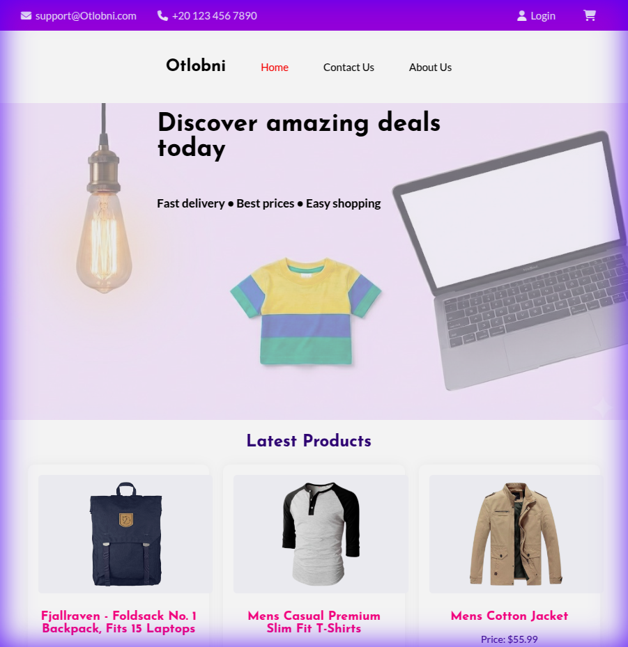
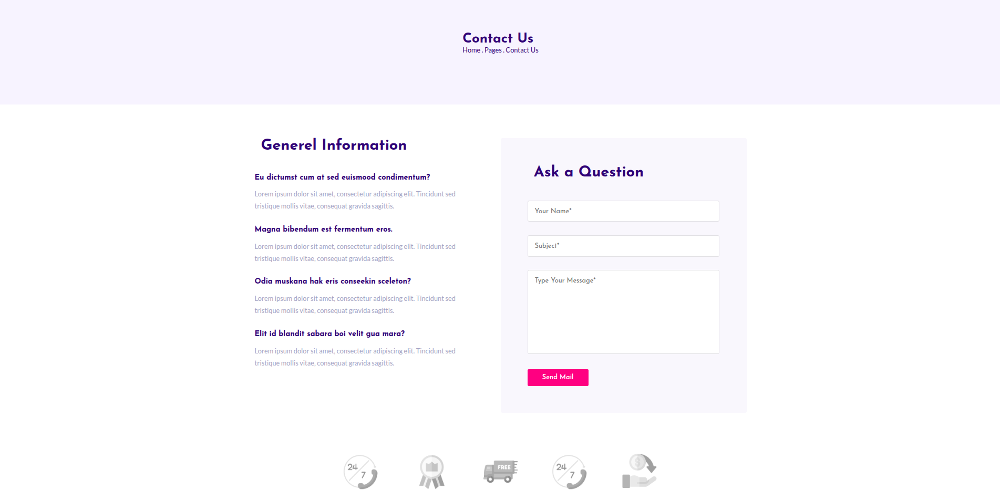
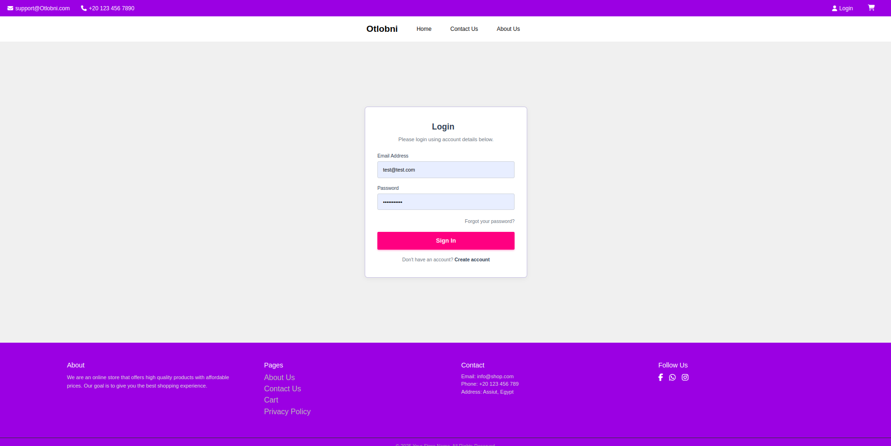
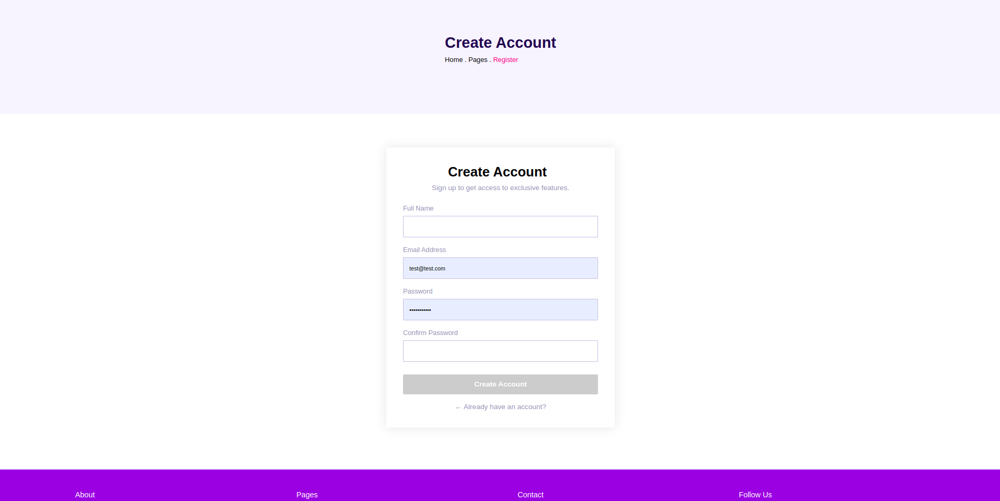
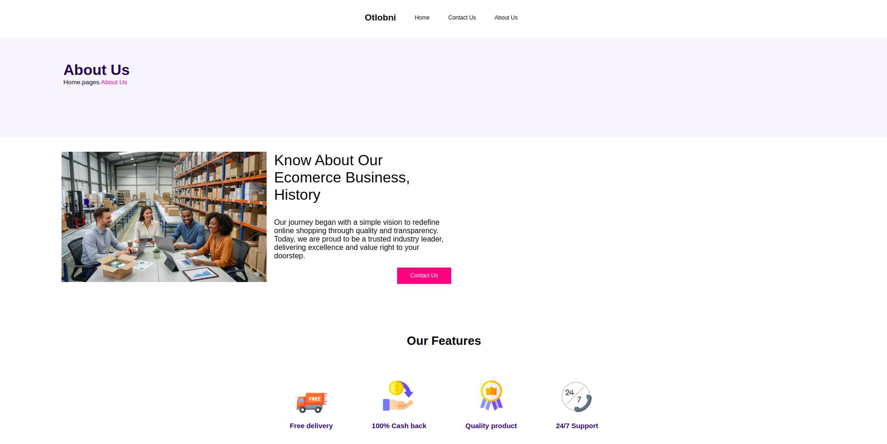

# Otlobni - E-commerce UI Kit



## 📋 Table of Contents
- [Overview](#-overview)
- [Features](#-features)
- [Screenshots](#-screenshots)
- [Technologies Used](#-technologies-used)
- [Installation](#-installation)
- [Usage](#-usage)
- [Project Structure](#-project-structure)

## 📖 Overview
**Otlobni** is a modern, responsive e-commerce web application designed with a premium user interface. Inspired by the **Hekto Ecommerce UI Kit**, this project aims to deliver a seamless shopping experience with a focus on aesthetics and usability.

The application fetches dynamic product data from the [FakeStore API](https://fakestoreapi.com/) and includes a fully functional shopping cart system using LocalStorage for data persistence.

## ✨ Features

### 🛍️ Product Browsing
- **Dynamic Product Listing:** Fetches and displays products dynamically from an external API.
- **Premium Product Cards:** Beautifully designed product cards with hover effects, shadow animations, and clear pricing/details.
- **Responsive Grid:** Adapts perfectly to Desktop, Tablet, and Mobile screens.

### 🛒 Shopping Cart System
- **Persistent Cart:** Items in the cart are saved to the browser's LocalStorage, so users don't lose them on refresh.
- **Real-time Calculations:** Automatically calculates line totals and subtotal/grand total.
- **Quantity Management:** Increase or decrease item quantities directly from the cart page.
- **Remove Items:** Easily remove individual items or clear the entire cart.

### 📄 Product Details
- **Detailed View:** Dedicated page for every product showing high-quality images, descriptions, and pricing.
- **Rating System:** Interactive star rating visualization based on product reviews.
- **Add to Cart:** One-click addition of products to the shopping cart.

### 📱 Responsive Design
- **Mobile-First Approach:** optimized for all device sizes.
- **Adaptive Navigation:** Hamburger menu and flexible layouts for smaller screens.

## 📸 Screenshots

### Home Page
The landing page featuring the latest products and hero section.


### Shopping Cart
A clean and functional cart interface for managing orders.


### Product Details
Comprehensive product information with an interactive layout.


### Contact Us
A clean and functional contact page for users to get in touch with the store.


### Login
A clean and functional login page for users to log in to their accounts.


### Register
A clean and functional register page for users to create new accounts.


### About Us
A clean and functional about page for users to learn more about the store.


### Forgot Password
A clean and functional forgot password page for users to reset their passwords.


## 🛠 Technologies Used
- **HTML5:** Semantic structure and accessibility.
- **CSS3:** Custom styling, Flexbox, Grid, and Media Queries.
- **JavaScript (ES6+):** DOM manipulation, API fetching (XMLHttpRequest), and LocalStorage logic.
- **Fonts:** [Josefin Sans](https://fonts.google.com/specimen/Josefin+Sans) (Headings) & [Lato](https://fonts.google.com/specimen/Lato) (Body).
- **Icons:** [FontAwesome 6](https://fontawesome.com/).
- **API:** [FakeStore API](https://fakestoreapi.com/) for mock product data.

## 🚀 Installation

1.  **Clone the repository:**
    ```bash
    git clone https://github.com/yourusername/otlobni-ecommerce.git
    ```
2.  **Navigate to the project directory:**
    ```bash
    cd otlobni-ecommerce
    ```
3.  **Open the project:**
    Simply open `home.html` in your preferred web browser.
    *   Or use a live server extension (recommended for best API performance).

## 🎮 Usage

1.  **Browse Products:** Scroll through the home page to see the latest items.
2.  **View Details:** Click on any product card to view more details.
3.  **Add to Cart:** Click the "Add to Cart" button on the product details page.
4.  **Manage Cart:** Click the cart icon in the navigation bar to view your selected items, adjust quantities, or proceed to checkout.

## 📂 Project Structure

```
Otlobni/
├── css/                  # Stylesheets
│   ├── style.css         # Global styles
│   ├── home.css          # Home page specific styles
│   ├── cart_style.css    # Cart page specific styles
│   └── ...
├── js/                   # JavaScript files
│   ├── home.js           # Home page logic (API fetch)
│   ├── cart.js           # Cart management logic
│   └── productDetails.js # Product details logic
├── imgs/                 # Image assets
├── Snaps/                # Project screenshots
├── home.html             # Main landing page
├── cart.html             # Shopping cart page
├── productDetails.html   # Product details page
├── contact_us.html       # Contact page
└── README.md             # Project documentation
```

---
© 2025 Otlobni. All Rights Reserved.
